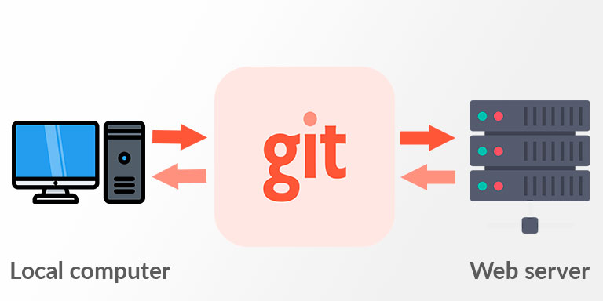

#  Servidor git

Essa documentação tem como objetivo ensinar a criar seu proprio servidor pessoal git. Para isso,
basta fazer git push do projeto e seguir os passos descritos abaixo. 

Nosso servidor sera criado em uma imagem docker para ilustrar como seria feito 
em um servidor real, para com isso aprender os conhecimentos aqui vistos e 
aplicar em grande escala em um servidor real.

## Subindo imagem

Para criar imagem do servidor: ``sudo docker build -t git-server .``

Rodando imagem: ``sudo docker run -d -p 2222:22 --name git-container git-server:latest``
 
Para entrar: ``sudo docker exec -it git-container bash``

Adicionar repositorio: git remote add origin git@seu-servidor-git:/caminho/para/repositorio.git

## Configuração

No modo interativo do shell siga os seguintes passos:

1. Configuração do servidor SSH.
2. Criação de um repositório Git.
3. Criação de um usuário Git
4. Configuração das chaves SSH.

### Configurando servidor SSH: 1#

Na imagem o servidor ssh ja esta sendo configurado, porem para fins didaticos irei explicar como
configuralo, para caso queiram fazer em uma maquina real.

Primeiro instale o cliente SSH: 

``sudo apt-get install openssh-server``

Caso o servidor SSH nao inicie automaticamente faça: 

``sudo service ssh start``

O servidor SSH estará ouvindo na porta 22 por padrão. 

Se você desejar alterar a porta, pode editar
o arquivo de configuração do servidor SSH. O arquivo de configuração geralmente 
está localizado em ``/etc/ssh/sshd_config``.

Agora você pode permitir que usuários específicos acessem o servidor Git via SSH. 

Para fazer isso
, adicione as chaves públicas dos usuários ao arquivo ``~/.ssh/authorized_keys`` do 
usuário "git" no servidor Git.

Agora reinicie o servidor SSH para as alteraçoes entrarem em vigor: ``sudo service ssh restart``

### Criando o repositorio do projeto: 2#

Crie o diretorio na home, nome do projeto e de sua escolha, porem aqui irei por de ``~/gitrep``.

Para isso basta fazer: ``mkdir ~/gitrep``

Agora alterne para o usuário Git usando o comando: ``su - <nome-do-usuario>``

Quando você executa o comando ``su - <nome-do-usuario>``, você está efetuando o login como o usuário 
e assumindo sua identidade. Isso é necessário para executar comandos como o usuário e realizar 
operações relacionadas ao Git.

Agora navegue ate o diretorio do projeto: ``cd /gitrepo``

Basta agora incializar um novo projeto:

``git init --bare <nome-do-repositorio>.git``

Agora com repositorio criado, você podera clonalo. Basta fazer:

``git clone git@<seu-servidor-git>:/caminho/para/repositorio.git``

### Configurando usuario GIT: 3#

O comando a seguir cria um usuario git

``adduser --shell /bin/bash <nome-do-usuario>``

Com isso sera criado um usuario git chamado pedro.

Agora temos que definir uma senha:

``passwd <senha-do-usuario>``

Agora você precisa gerar um par de chaves SSH para o usuário Git. Essas chaves serão usadas para
autenticação ao acessar o servidor Git remotamente. Ainda dentro do shell do servidor Git,
execute o seguinte comando como usuário "git":

``su - git``

``ssh-keygen -t rsa``

Isso irá gerar uma chave SSH pública e privada para o usuário Git. Quando solicitado, 
você pode pressionar Enter para aceitar o local padrão e não definir uma senha para a chave.

Para permitir que o usuário Git tenha acesso ao diretório de repositórios, certifique-se de 
que o diretório /gitrepo (ou o diretório onde você pretende armazenar os repositórios) 
tenha as permissões corretas. Dentro do shell do servidor Git, execute o seguinte comando:

``chown -R git:git /gitrepo``

### Configuração das chaves SSH: 4#

Agora vamos configurar a chave ssh para o usuario, seguindo passos abaixo.

Alterne para o usuário:

``su - <nome-do-usuario>``

Caso o diretorio ``~/.ssh`` nao existe, basta criar um com ``cd ~/.ssh`` 
do contrario, pule essa etapa.

Agora gere as chaves ``ssh``.

``ssh-keygen``

OBS: As chaves publicas nao devem ser criadas no servidor, e sim na sua maquina local. Elas serao
usadas como credencial para subir dados ao servidor Git.

Agora abra o arquivo ``id_rsa.pu`` e copie a chave publica e em seu computador local
adicione a chave publica ao arquivo ``~/.ssh/authorized_key`` que estara no servidor, lembre
que ao fazer isso voce deve estar logado com seu usuario ``su - <nome-do-usuario>``.

Verfique tambem as permissoes do arquivo ``authorized_keys`` usando:

``chmod 600 ~/.ssh/authorized_keys``

Isso garante que apenas seu usuario tenha permissao de leitura do arquivo.

por fim reinicialize o servidor ssh para alteracoes entrarem em vigor:

``sudo service ssh restart``

Agora a chave ``ssh``esta configurada.

Agora na sua maquina local basta clona o projeto com o seguinte:

``git clone git@seu-servidor-git:/caminho/para/repositorio.git``


### Especionando o diretorio do servidor

```
root@a6f187473170:/gitrepo# ls
HEAD  branches  config  description  hooks  info  objects  refs
```

Agora uma breve descrição sobre a importancia de cada arquivo e diretorio
exposto nesse ``ls``.

 - ``HEAD``: O arquivo HEAD é um ponteiro especial que indica a branch atual em que você está trabalhando.
 - ``branches``: O diretório branches contém os ponteiros para as branches existentes no repositório
 - ``config``: O arquivo config contém as configurações do repositório Git, como informações 
    do remoto, aliases, hooks, entre outras configurações.
 - ``description``: O arquivo description é usado por servidores Git remotos para 
    exibir uma descrição do repositório.
 - ``hooks``: O diretório hooks contém scripts personalizados que podem ser executados em diferentes 
    eventos do Git, como pré-commit, pós-commit, pré-push, entre outros.
 - ``info``: O diretório info contém arquivos adicionais de informações do repositório, como exclude, 
    que especifica padrões de exclusão para o gitignore.
 - ``objects``: O diretório objects contém os objetos Git, como commits, árvores e blobs, que 
    armazenam os dados do seu repositório.
 - ``refs``: O diretório refs contém referências para commits, como branches e tags.

 Esses diretórios e arquivos são criados automaticamente quando você inicializa um repositório Git.
